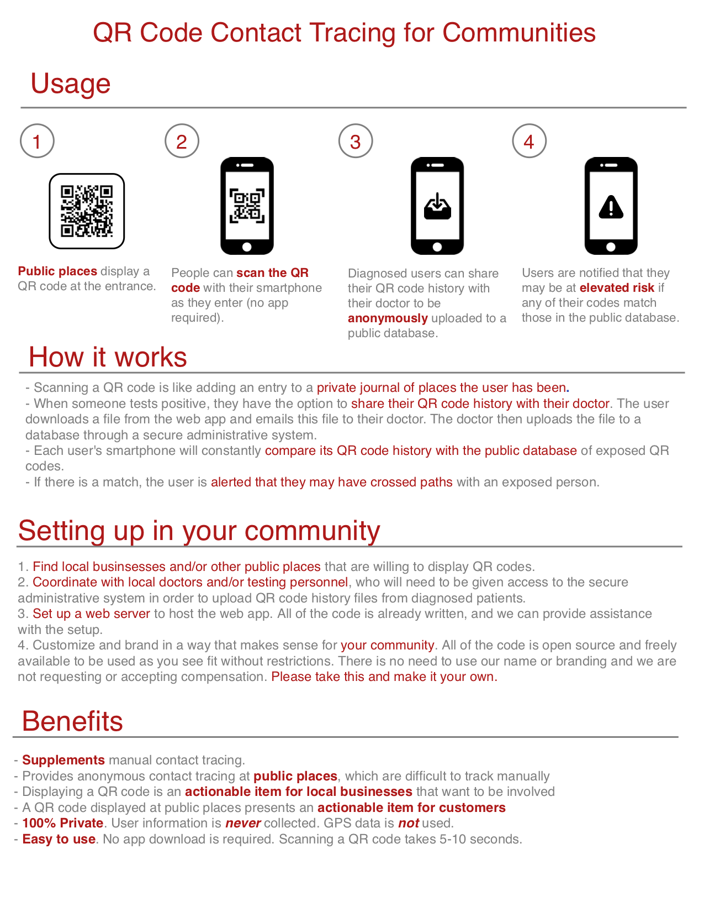

# TrackCOVID

QR Code-Based Contact Tracing for Communities

This is an open source project which we provide freely to communities which are interested in setting up digital contact tracing to supplement manual contact tracing in a way that is both easy to use and 100% private.

We propose a concrete strategy for setting up QR code-based contact tracing in your community, and we provide all of the source code necessary for this to happen. We believe our approach can add an additional layer of protection as public places begin reopening. Manual contact tracing in public places is very difficult, if not impossible in many cases. Our approach can help to notify people of potential exposure at these public places in a way that does not invade their privacy.

If you are interested, we are happy to collaborate as needed to make this a reality in your community. We do this as a public service without asking for anything in return.

If you are interested in setting up this project in your community or jurisdiction, [click here](https://github.com/tyleryasaka/TrackCOVID-community/blob/master/README.md) to learn more.

- About the project:
https://trackcovid.net
- App demo:
https://demo.trackcovid.net
- Read the peer-reviewed paper in JMIR mHealth and uHealth:
https://doi.org/10.2196/18936
- Instructions for setting up in your community or jurisdiction: https://github.com/tyleryasaka/TrackCOVID-community/blob/master/README.md

## Source code

The app source code in this repository is stale. The up-to-date code is located at: https://github.com/tyleryasaka/TrackCOVID-community

## Contributors

- [Ben Stedman](https://benstedman.com/): logo
- [Tyler Yasaka](https://tyleryasaka.me/): development
- [@equinteros61](https://github.com/equinteros61): translation (Spanish)
- [@sawravchy](https://github.com/sawravchy): translation (Bengali)
- You? (check out our [interest form](https://docs.google.com/forms/d/e/1FAIpQLSfj8AxQ5hVYF2cvlZGv1yopOCLHn71NigqPjyFYSv6sEaQijg/viewform?usp=sf_link))
